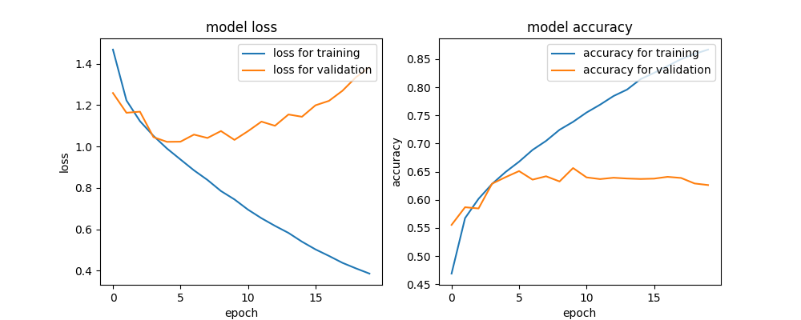

# cnn_with_cifar10

cifar10データセットを用いてCNNでクラス分類するレポジトリです。

## コミット前に
```
make format
make lint
```

## パッケージのインストール
`poetry install`


## データの準備
[The CIFAR-10 dataset](http://www.cs.toronto.edu/~kriz/cifar.html)の`CIFAR-10 python version`を選択して、`cifar-10-python.tar.gz`をダウンロード。 
レポジトリ直下に置く。

`tar -zxvf cifar-10-python.tar.gz`
で解凍

`python unpack.py`
で訓練データとテストデータに分割して展開


## モデルの学習とテストデータでの精度確認
`python train.py`


## 学習結果



## Qiita
- [GCP Machine Learning Engineer 知識チェック 100本ノック　問題編 Part1](https://qiita.com/qwerty1234/items/cef146bd0545425ea1e3)
- [cifar10データセットでcnnを使ってクラス分類してみた](https://qiita.com/qwerty1234/items/e74cf8b94271cf8b29be)

## Reference
https://www.tensorflow.org/tutorials/images/cnn?hl=ja